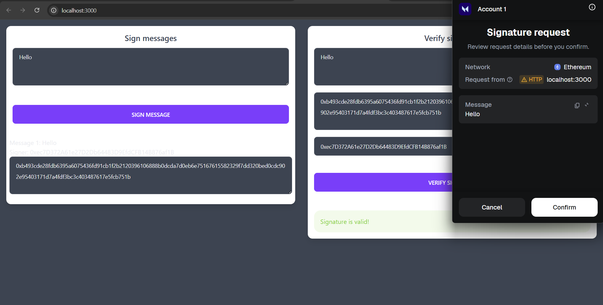
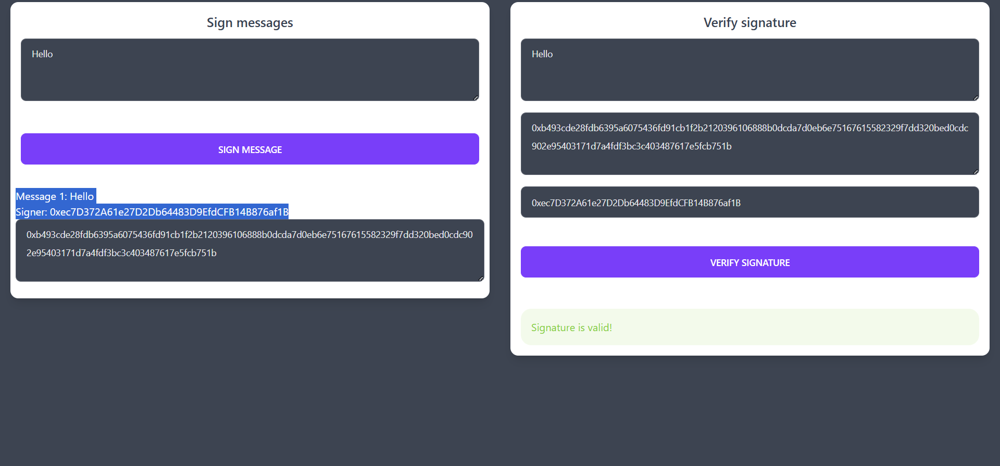

# 🔐 Digital Signature Verification Using MetaMask (Ethereum)

A modern **React-based decentralized application (DApp)** that demonstrates  
**message signing and signature verification** using **MetaMask** and **Ethereum cryptography (ECDSA)**.

This project showcases how digital signatures work in blockchain systems **without exposing private keys**, making it ideal for **authentication, verification, and security demos**.

---

## ✨ Features

- ✍️ Sign arbitrary messages using **MetaMask**
- 🔎 Verify Ethereum signatures using **ECDSA (secp256k1)**
- 👤 Recover signer address from the signed message
- 🔐 No private key handling — keys stay securely inside MetaMask
- ⚡ Fully client-side (no backend required)
- 🎨 Clean, professional UI suitable for demos & portfolios

---

## 🖥️ Application Preview

### 🔹 Message Signing


### 🔹 Signature Verification


---

## 🧠 How It Works

1. User enters a message
2. MetaMask prompts the user to **sign the message**
3. A cryptographic signature is generated using **ECDSA**
4. The app recovers the signer’s **Ethereum address**
5. The recovered address is compared with the claimed signer
6. Verification result is displayed instantly

---

## 🔐 Cryptography Behind the Scenes

- **Elliptic Curve Digital Signature Algorithm (ECDSA)**
- Curve used: **secp256k1** (Ethereum standard)
- Message signing via `personal_sign`
- Address recovery using `ethers.js`

> 🛑 Private keys never leave MetaMask.  
> This application only works with **public cryptographic data**.

---

## 🛠️ Tech Stack

| Technology | Usage |
|----------|------|
| React (CRA) | Frontend framework |
| Ethers.js | Ethereum interaction & signature recovery |
| MetaMask | Wallet & message signing |
| JavaScript (ES6) | Core logic |
| HTML / CSS | UI styling |

---

## 🚀 Getting Started (Local Setup)

### 1️⃣ Clone the repository
```bash
git clone https://github.com/chetanmeshram10/Digital-Signature-Verification-Using-MetaMask-Cryptocurrency-Wallet.git
cd Digital-signature-verification
```

2️⃣ Install dependencies
```
npm install --legacy-peer-deps
```

3️⃣ Start the development server
```
npm start
```

Open in browser:
```
http://localhost:3000
```

## 🦊 MetaMask Requirements
  - Install MetaMask browser extension
  - Use Chrome / Brave / Edge
  - Any Ethereum network works (no gas required for signing)

---

## 📂 Project Structure
```
src/
 ├── App.js
 ├── SignMessage.js
 ├── VerifyMessage.js
 ├── SuccessMessage.js
 ├── ErrorMessage.js
 └── index.js

public/
 └── index.html
```
---


## 👨‍💻 Author

Chetan Meshram
Mtech IT IIITA Student | Blockchain & Cryptography Enthusiast

🔗 GitHub: https://github.com/chetanmeshram10

---

## ⭐ Support
If you found this project useful:
- ⭐ Star the repository
- 🍴 Fork it
- 📢 Share
